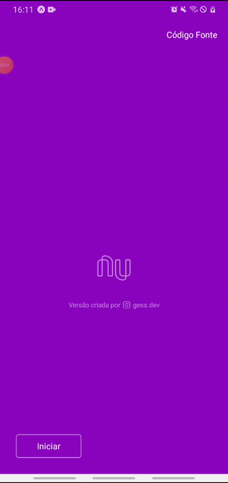

<h1 align="center"> Nubank Clone React Native</h1>

 This application was made for the purpose of study, feel free to learn from it viewing, just as I learned when developing it. In it you learn about flexbox design, compounding, props, state management with hooks, animations and more. 
In this application I did not use a database, all the data shown in the interface are copied from the original application or provided by the user in one of the home screens

   
  <h6 align="center">Screens on Android</h6>

<h2 align="center">Main technologies used<h2>
  
- [Javascript](https://developer.mozilla.org/en-US/docs/Web/JavaScript/) - Javascript is a very popular high-level programming language that can be applied in a variety of scenarios

- [React Native](http://facebook.github.io/react-native/) - React Native is a Javascript framework for building multiplatform mobile application interfaces (Android and IOS) rendering native code 

- [React Navigation](https://reactnavigation.org/) - React Navigation is a library that helps you navigate between screens in React Native

- [Expo](https://expo.io/) - Expo is an open-source platform for making universal native apps for Android, iOS, and the web with JavaScript and React.
